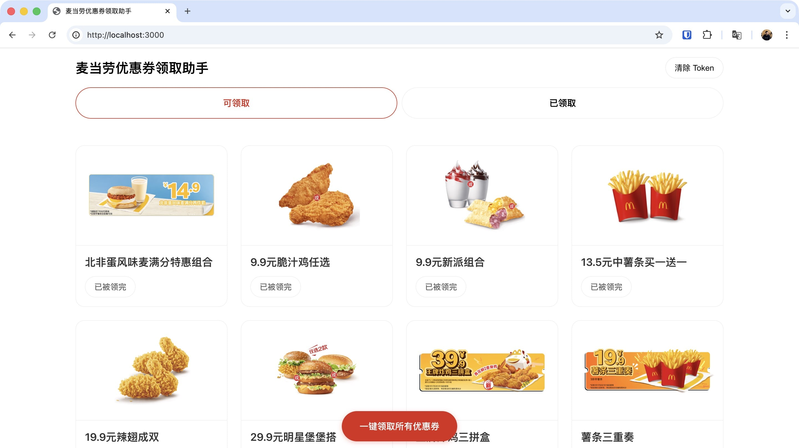
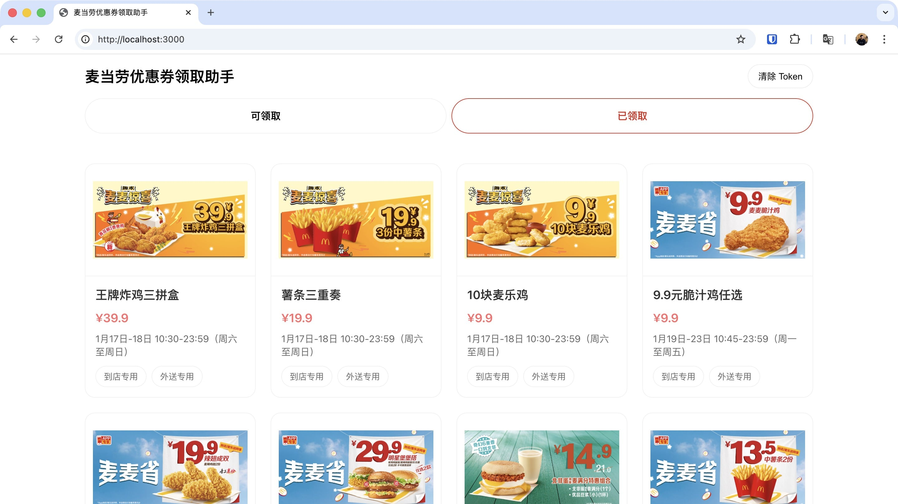

# 麦当劳优惠券领取助手

一个基于 React + TypeScript + Vite 的现代化 Web 应用，用于通过麦当劳 MCP Server 领取和管理优惠券。

## 📸 界面预览





## ✨ 功能特性

- 🔑 **MCP Token 管理**：安全存储和管理您的 MCP Token
- 🎫 **可领取优惠券**：浏览所有可领取的优惠券列表，支持一键领取所有优惠券
- 💳 **已领取的优惠券**：查看已领取的优惠券详情，包括有效期、标签等信息
- 📱 **响应式设计**：完美适配桌面端和移动端
- 🎨 **现代化 UI**：采用麦当劳品牌设计语言，界面简洁美观


## 🛠️ 技术栈

- **前端框架**：React 18 + TypeScript
- **构建工具**：Vite 5
- **HTTP 客户端**：Axios
- **样式**：CSS3（支持响应式布局）

## 📦 安装

### 前置要求

- Node.js >= 16.0.0
- npm >= 7.0.0

### 安装依赖

```bash
npm install
```

## 🚀 快速开始

### 开发模式

```bash
npm run dev
```

应用将在 `http://localhost:3000` 启动，并自动打开浏览器。

### 构建生产版本

```bash
npm run build
```

构建产物将输出到 `dist` 目录。

### 预览生产版本

```bash
npm run preview
```

## 📖 使用说明

### 1. 申请 MCP Token

在使用本应用之前，您需要先申请麦当劳 MCP Token：

1. 访问 [麦当劳 MCP 官网](https://open.mcd.cn/mcp)
2. 点击右上角【登录】按钮，使用手机号验证登录
3. 登录后点击【控制台】
4. 点击【激活】按钮申请 MCP Token
5. 同意服务协议后即可获得 Token

### 2. 设置 Token

1. 启动应用后，在首页输入您的 MCP Token
2. 点击【确认设置】进行验证
3. Token 验证成功后即可使用所有功能

### 3. 使用功能

#### 可领取优惠券

- 浏览所有可领取的优惠券列表
- 点击页面底部的【一键领取所有优惠券】按钮自动领取所有可用优惠券
- 或点击单个优惠券卡片上的【领取】按钮领取指定优惠券

#### 已领取的优惠券

- 查看已领取的优惠券详情
- 查看优惠券的有效期、标签等信息

## 📁 项目结构

```
m/
├── src/
│   ├── components/          # React 组件
│   │   ├── AvailableCoupons.tsx/css    # 可领取优惠券
│   │   ├── MyCoupons.tsx/css          # 已领取优惠券
│   │   ├── Dashboard.tsx/css          # 主面板
│   │   ├── TokenSetup.tsx/css         # Token 设置
│   │   ├── ClaimResultModal.tsx/css   # 领券结果弹窗
│   │   └── NoTokenPrompt.css          # 无 Token 提示样式
│   ├── services/
│   │   └── mcpClient.ts               # MCP 客户端
│   ├── utils/
│   │   └── storage.ts                 # 本地存储工具
│   ├── App.tsx                        # 主应用组件
│   ├── App.css                        # 公共样式
│   ├── main.tsx                       # 入口文件
│   └── vite-env.d.ts                 # Vite 类型定义
├── screenshots/                       # 项目截图
│   ├── screenshot-1.jpg
│   └── screenshot-2.jpg
├── index.html                         # HTML 模板
├── vite.config.ts                     # Vite 配置
├── tsconfig.json                      # TypeScript 配置
└── package.json                       # 项目配置
```

## 🔧 开发说明

### 开发环境配置

开发环境已配置 Vite 代理，自动处理 CORS 跨域问题：

```typescript
// vite.config.ts
proxy: {
  '/api/mcp': {
    target: 'https://mcp.mcd.cn',
    changeOrigin: true,
    rewrite: (path) => path.replace(/^\/api\/mcp/, '/mcp-servers/mcd-mcp'),
  }
}
```

### 代码规范

- 使用 TypeScript 进行类型检查
- 遵循 React Hooks 最佳实践
- CSS 样式采用 BEM 命名规范
- 公共样式统一放在 `App.css`

## 🐛 故障排除

### Token 验证失败

**可能原因：**
- Token 格式不正确（包含多余空格）
- Token 未激活或已过期
- Token 复制不完整

**解决方法：**
1. 检查 Token 是否正确复制（不要有多余空格）
2. 访问 [麦当劳 MCP 官网](https://open.mcd.cn/mcp) 确认 Token 是否已激活
3. 尝试重新申请 Token

### 网络请求失败

**可能原因：**
- 网络连接问题
- CORS 跨域问题（开发环境已通过 Vite 代理解决）

**解决方法：**
1. 检查网络连接是否正常
2. 重启开发服务器：`npm run dev`
3. 检查浏览器控制台是否有错误信息
4. 确认 Vite 代理配置是否正确

### 请求频率过高（429 错误）

**原因：**
每个 Token 每分钟最多允许 600 次请求

**解决方法：**
- 等待一段时间后重试
- 减少操作频率

### 其他错误码

- **401** - Token 无效或已过期，请重新申请并设置
- **403** - Token 权限不足
- **404** - API 端点不存在，检查 MCP Server 地址
- **500** - 服务器内部错误，请稍后重试

### 数据加载失败

**解决方法：**
1. 刷新页面重试
2. 清除浏览器缓存
3. 检查 Token 是否仍然有效
4. 查看浏览器控制台的错误信息

## ⚠️ 注意事项

- ⚠️ 每个 Token 每分钟最多允许 600 次请求，超过限制会返回 429 错误码
- 🔒 Token 存储在浏览器本地存储中，请妥善保管，不要分享给他人
- 📱 应用支持响应式设计，可在移动设备上使用
- ⚠️ 重复领取的优惠券将无效
- 🌐 生产环境需要服务器支持 CORS，或使用代理服务器

## 📝 更新日志

### v1.0.0

- ✨ 初始版本发布
- ✅ 支持 MCP Token 管理
- ✅ 支持浏览和领取优惠券
- ✅ 支持查看已领取的优惠券
- ✅ 响应式设计
- ✅ 现代化 UI 设计

## 👨‍💻 开发者

Developed by [Ruiying Li](https://www.ruiying.li/)

## 📄 许可证

© 2020-2025 McDonald's. All Rights Reserved
